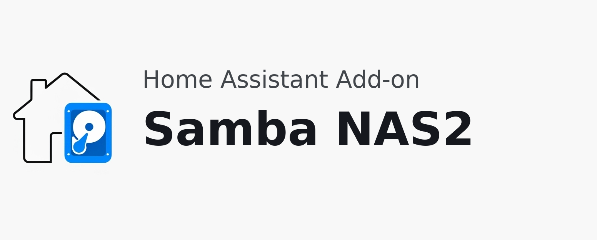

# Home Assistant Add-on: Samba NAS2 

## 🚨 Important Note 🚨

This add-on has been designed, built, and tested to work exclusively with HAOS (Home Assistant Operating System). Using it with other installation types is not recommended, as native host-level solutions are more suitable for those environments.

## Feature Comparison: SambaNAS vs SambaNAS2

### Introduction

SambaNAS2 is the newly released successor to the original SambaNAS add-on. Please note that SambaNAS2 is still under active development and does not yet include all features available in the original SambaNAS. Advanced functionalities will be introduced in future versions as the project continues to evolve.

The following table compares the major functionalities available in SambaNAS and SambaNAS2:

| Functionality                     | SambaNAS | SambaNAS2 |
|------------------------------------|:--------:|:---------:|
| **Network Sharing** | | |
| CIFS Volume Exporting              |    ✔️     |    ✔️      |
| NFS Volume Exporting               |    ❌     |  🚧 Soon   |
| SMB Multichannel Support           |    ✔️     |    ✔️      |
| WSDD and WSDD2 Integration         |    ✔️     |    ❌     |
| WSDD-Native                       |    ❌     |    ✔️     |
| Samba over QUIC Support            |    ❌     |  🚧 Soon   |
| **Volume Management** | | |
| Mounting additional volumes        |    ✔️     |    ✔️      |
| Enhanced mount flags management    |    ❌     |    ✔️      |
| Unmounting volumes                 |    ❌     |    ✔️      |
| Hotplug device events              |    ❌     |    ✔️      |
| **User & Access Control** | | |
| User Management                    |    ✔️     |    ✔️      |
| User HA Integration                |    ❌     |  🚧 Soon   |
| Advanced Share Permissions         |    ❌     |  🚧 Soon   |
| Guest Share Access                |    ❌     |    ✔️      |
| Recycle Bin Support                |    ❌     |    ✔️      |
| **Administration & Monitoring** | | |
| Web UI for Management              |    ❌     |    ✔️      |
| Enhanced Logging                   |    ❌     |    ✔️      |
| Regular Updates                    |  🔚 EOL   |    ✔️      |
| Watchdog                           |    ✔️     |    ✔️   |
| **Integration** | | |
| MQTT integration                   |    ✔️     |    ❌      |
| HA Native API Integration          |    ❌     |    ✔️      |
| Component Integration              |    ❌     |  🚧 Soon   |
| **Disk Management** | | |
| SMART Monitoring                  |    ✔️     |    🚧 Soon      |
| SMART Test Support                      |    ❌     |    🚧 Soon      |
| Disk Spindown Support              |    ✔️     |    🚧 Soon      |
| Per Disk Spindown Support              |    ❌     |    🚧 Soon      |
| **Filesystem Support** | | |
| Filesystem Checking  | ❌ | 🚧 Soon  |
| Advanced XFS Support | ❌ | 🚧 Soon  |
| Advanced BTRFS Support | ❌ | 🚧 Soon  |
| Advanced ZFS Support                       |    ❌     |    🚧 Soon   |

> ✔️ = Supported  ❌ = Not Supported  🚧 Soon = Coming in future versions  🔚 EOL = End of Life

## Installation

**Requirements:**
- Home Assistant 2025.8.0 or newer
- Home Assistant Operating System (HAOS) - recommended and tested platform
- Supported architectures: armv7, aarch64, amd64

Follow these steps to get the add-on installed on your system:

1. Navigate in your Home Assistant frontend to **Supervisor** -> **Add-on Store**.
2. Find the "Samba NAS2" add-on and click it.
3. Click on the "INSTALL" button.
4. Enable the "Show in sidebar" option.
5. Disable the "Protection mode" option.
6. Click the "START" button.
7. Wait for the add-on to start.
8. Click "Samba NAS 2" in your sidebar to access the web interface.
9. Configure your username and password in the web interface.

## How to Use

1. Access the web interface through the Home Assistant sidebar.
2. Set a username and password for accessing your shares.
3. Review the enabled shares and disable any you don't plan to use. You can re-enable shares later if needed.

## Web Interface

Samba NAS2 includes an integrated web interface for management and configuration. You can access it in two ways:

1. **Through Home Assistant Ingress** (Recommended): Click "Samba NAS 2" in your Home Assistant sidebar. This provides seamless integration within your Home Assistant interface.

2. **Direct Access**: If you need to access the interface outside of Home Assistant, connect directly using `http://<HOME_ASSISTANT_IP>:3000`. Note that this port is not exposed by default and may require additional configuration.

The web interface provides access to SRAT (Samba REST Administration Tool), which offers a user-friendly interface for configuring and managing your Samba shares, users, and settings.

## Connection

To connect to the shares:
- **Windows**: Use `\\<IP_ADDRESS>\`
- **macOS/Linux**: Use `smb://<IP_ADDRESS>`

This add-on exposes the following directories over SMB (Samba):

| Directory       | Description                                                              |
| --------------- | ------------------------------------------------------------------------ |
| `addons`        | Local add-ons storage.                                          |
| `backup`        | Home Assistant backups and snapshots.                                              |
| `config`        | Home Assistant configuration files.                           |
| `addon_configs` | Add-on base configuration directory.                     |
| `media`         | Local media files storage.                                           |
| `share`         | Shared data between add-ons and Home Assistant. |
| `ssl`           | SSL certificates storage.                                       |

## Configuration

Example configuration with all available options and their default values:

```yaml
srat_update_channel: none
log_level: warning
disable_ipv6: true
leave_front_door_open: false
```

**Note**: All configuration options are optional. Only specify options when you want to change the default value.

### Option: `log_level` (optional)

The `log_level` option controls the verbosity of log output from the add-on, which is useful when troubleshooting issues. Possible values are:

- **trace**: Shows every detail, including all internal function calls.
- **debug**: Shows detailed debug information.
- **info**: Shows normal, interesting events (default).
- **warning**: Shows exceptional occurrences that are not errors.
- **error**: Shows runtime errors that do not require immediate action.
- **fatal**: Shows critical failures that make the add-on unusable.

Each level automatically includes log messages from more severe levels (e.g., `debug` also shows `info` messages). The default setting is `info`, which is recommended unless you are troubleshooting.


### Option: `disable_ipv6` (optional)

Controls whether the add-on uses IPv6 networking.

- `true` (default): Disables the IPv6 stack inside the add-on and forces Samba services to bind only to IPv4. Recommended if you don't explicitly need IPv6.
- `false`: Leaves IPv6 enabled for environments that require dual-stack access.


### Option: `srat_update_channel` (optional) **_Experimental_**

SRAT (Samba REST Administration Tool) is a new system designed to provide a simplified user interface for configuring Samba. It has been developed specifically for this add-on within Home Assistant but can also be used in other contexts.

Setting this option to `release`, `prerelease`, or `develop` enables automatic updates for SRAT (Samba REST Administration Tool) on the chosen channel:

- `none`: No automatic updates (default)
- `release`: Stable releases only
- `prerelease`: Beta/pre-release versions
- `develop`: Development versions (experimental, use with caution; not available in release builds)

⚠️ **Important**: When you select `release`, `prerelease`, or `develop`, SRAT updates are downloaded and installed automatically. These updates are persistent and stored in the add-on's data directory.

If you switch to `none`, any previously downloaded updates in the data directory will be ignored but not removed. To clean up the directory and remove old downloads, use the `clean_upgrade_dir` option.

Defaults to `none`.

### Option: `clean_upgrade_dir` (optional)

When enabled (set to `true`), this option removes all downloaded binary updates from the add-on's data directory. Use this only in emergency situations if you need to clear out old or corrupted SRAT update files.

⚠️ **Warning**: This action is permanent and cannot be undone. Only enable this if you fully understand the consequences.

Defaults to `false`.

### Option: `leave_front_door_open` (optional)

When enabled (set to `true`), this option disables authentication for the SRAT web administration interface (accessed via Home Assistant Ingress or, if exposed, `http://<HOME_ASSISTANT_IP>:3000`).

It does not grant guest access to SMB shares. Access to your Samba shares continues to be enforced by the users, passwords, and permissions you configure in SRAT.

⚠️ **Security Warning**: Enabling this option exposes the administration UI without login. Anyone on your network could change settings, manage users, and modify shares. Enable only on trusted, isolated networks and only if you fully understand the risk.

Defaults to `false` (authentication required for SRAT).

## Support

### Do You Like This Add-on?
<a href="https://www.buymeacoffee.com/ypKZ2I0"></a>

### Reporting Issues

If you've found a bug, please [open an issue on our GitHub][issue].

[issue]: https://github.com/dianlight/hassio-addons/issues
[reddit]: https://reddit.com/r/homeassistant
[repository]: https://github.com/dianlight/hassio-addons
