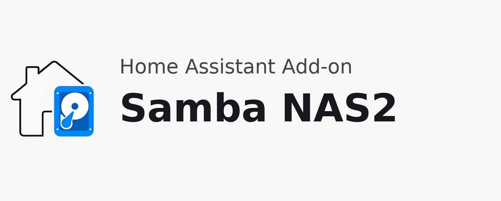

# Home Assistant Add-on: Samba NAS2 

## 🚨 Important Note 🚨

This add-on has been designed, built, and tested to work exclusively with HAOS (Home Assistant Operating System). Using it with other installation types is not recommended, as native host-level solutions are more suitable for those environments.

## Feature Comparison: SambaNAS vs SambaNAS2

### Introduction

SambaNAS2 is the newly released successor to the original SambaNAS add-on. Please note that SambaNAS2 is still under active development and does not yet include all features available in the original SambaNAS. Advanced functionalities will be introduced in future versions as the project continues to evolve.

Feature availability can vary by supported architecture and HAOS board. Some capabilities depend on extra kernel modules provided through the [hasos_more_modules repository](https://github.com/dianlight/hasos_more_modules).

The following table compares the major functionalities available in SambaNAS and SambaNAS2:

| Functionality                     | SambaNAS | SambaNAS2 |
|------------------------------------|:--------:|:---------:|
| **Network Sharing** | | |
| CIFS Volume Exporting              |    ✔️     |    ✔️      |
| NFS Volume Exporting               |    ❌     |  🧪 🔌 (internal HA-addon use only) |
| SMB Multichannel Support           |    ✔️     |    ✔️      |
| WSDD and WSDD2 Integration         |    ✔️     |    ❌     |
| WSDD-Native                       |    ❌     |    ✔️     |
| Avahi/mDNS Support                 |    ✔️     |    🚧 Soon (via component)     |
| Samba over QUIC Support            |    ❌     |  🧪 🔌   |
| **Volume Management** | | |
| Mounting additional volumes        |    ✔️     |    ✔️      |
| Enhanced mount flags management    |    ❌     |    ✔️      |
| Unmounting volumes                 |    ❌     |    ✔️      |
| Hotplug device events              |    ❌     |    ✔️      |
| **User & Access Control** | | |
| User Management                    |    ✔️     |    ✔️      |
| User HA Integration                |    ❌     |  🚧 Soon   |
| Advanced Share Permissions         |    ❌     |  🚧 Soon   |
| Guest Share Access                |    ❌     |    ✔️      |
| Recycle Bin Support                |    ❌     |    ✔️      |
| **Administration & Monitoring** | | |
| Web UI for Management              |    ❌     |    ✔️      |
| Enhanced Logging                   |    ❌     |    ✔️      |
| Regular Updates                    |  🔚 EOL   |    ✔️      |
| Watchdog                           |    ✔️     |    ✔️   |
| **Integration** | | |
| MQTT integration                   |    ✔️     |    ❌      |
| HA Native API Integration          |    ❌     |    ✔️      |
| Component Integration              |    ❌     |  🚧 Soon   |
| **Disk Management** | | |
| SMART Monitoring                  |    ✔️     |    ✔️    |
| SMART Test Support                      |    ❌     |    ✔️   |
| Disk Spindown Support              |    ✔️     |    🚧 Soon      |
| Per Disk Spindown Support              |    ❌     |    🚧 Soon      |
| **Filesystem Support** | | |
| Filesystem Checking  | ❌ | 🚧 Soon  |
| Advanced XFS Support | ❌ | 🚧 Soon  |
| Advanced BTRFS Support | ❌ | 🚧 Soon  |
| Advanced ZFS Support                       |    ❌     |    🚧 Soon   |
| **Other Features** | | |
| External Kernel Modules Support                     |    ❌     |    ✔️  |


> ✔️ = Supported  ❌ = Not Supported  🧪 = Experimental  🔌 = Only with extra kernel modules (see hasos_more_modules)  🚧 Soon = Coming in future versions  🔚 EOL = End of Life

## Installation

**Requirements:**
- Home Assistant 2025.8.0 or newer
- Home Assistant Operating System (HAOS) - recommended and tested platform
- Supported architectures: ~~armv7,~~ aarch64, amd64

Follow these steps to get the add-on installed on your system:

1. Open your Home Assistant **Profile** page (click your user avatar in the lower-left sidebar).
2. Enable the **Advanced Mode** toggle for your user account.
3. Navigate in your Home Assistant frontend to **Supervisor** -> **Add-on Store**.
4. Find the "Samba NAS2" add-on and click it.
5. Click on the "INSTALL" button.
6. Enable the "Show in sidebar" option.
7. Disable the "Protection mode" option.
8. Click the "START" button.
9. Wait for the add-on to start.
10. Click "Samba NAS 2" in your sidebar to access the web interface.
11. Configure your username and password in the web interface.

## How to Use

1. Access the web interface through the Home Assistant sidebar.
2. Set a username and password for accessing your shares.
3. Review the enabled shares and disable any you don't plan to use. You can re-enable shares later if needed.

## Web Interface

Samba NAS2 includes an integrated web interface for management and configuration. You can access it in two ways:

1. **Through Home Assistant Ingress** (Recommended): Click "Samba NAS 2" in your Home Assistant sidebar. This provides seamless integration within your Home Assistant interface.

2. **Direct Access**: If you need to access the interface outside of Home Assistant, connect directly using `http://<HOME_ASSISTANT_IP>:3000`. Note that this port is not exposed by default and may require additional configuration.

The web interface provides access to SRAT (Samba REST Administration Tool), which offers a user-friendly interface for configuring and managing your Samba shares, users, and settings.

## Connection

To connect to the shares:
- **Windows**: Use `\\<IP_ADDRESS>\`
- **macOS/Linux**: Use `smb://<IP_ADDRESS>`

This add-on exposes the following directories over SMB (Samba):

| Directory       | Description                                                              |
| --------------- | ------------------------------------------------------------------------ |
| `addons`        | Local add-ons storage.                                          |
| `backup`        | Home Assistant backups and snapshots.                                              |
| `config`        | Home Assistant configuration files.                           |
| `addon_configs` | Add-on base configuration directory.                     |
| `media`         | Local media files storage.                                           |
| `share`         | Shared data between add-ons and Home Assistant. |
| `ssl`           | SSL certificates storage.                                       |

## NFS exports (🧪 Experimental, 🔌 Extra Modules on Some Boards)

NFS services run under s6 supervision and the exports file is **automatically managed by SRAT** for internal Home Assistant communication.

- SRAT (Samba REST Administration Tool) generates and maintains the `/etc/exports` file based on your share configuration in the web interface.
- NFS exports are **limited to internal use** between Home Assistant and this add-on only.
- Only the following share types can be exported via NFS: **Media**, **Backup**, and **Share**.
- The NFS server waits for the exports file to be generated before starting.

**How to enable NFS exports:**

1. Access the SRAT web interface (Samba NAS 2 in your sidebar)
2. Configure NFS export options for Media, Backup, or Share share types
3. SRAT will automatically generate the appropriate `/etc/exports` configuration
4. The NFS server will detect the changes and apply them automatically

**Notes:**
- NFS exports are **only** available for the following share types: `Media`, `Backup`, and `Share`
- NFS is intended for internal communication between Home Assistant and the add-on, not for external network access
- Not all filesystem types support safe NFS re-export. Depending on the source filesystem and mount options, some paths may be incompatible with NFS export semantics.
- Incompatible export configurations are handled automatically: NFS export application is retried/adjusted, while SMB access for those shares remains available.
- 🧪 This is an experimental feature; please test carefully before relying on it in production
- 🔌 Depending on your HAOS architecture/board, NFS functionality may require enabling `use_external_kernel_modules` to load extra kernel modules
- Changes made through SRAT are applied automatically without requiring an add-on restart

## Configuration

Example configuration with all available options and their default values:

```yaml
srat_update_channel: none
auto_update: true
log_level: warning
disable_ipv6: true
leave_front_door_open: false
factory_reset: false
use_external_kernel_modules: false
```

**Note**: All configuration options are optional. Only specify options when you want to change the default value.

### Option: `log_level` (optional)

The `log_level` option controls the verbosity of log output from the add-on, which is useful when troubleshooting issues. Possible values are:

- **trace**: Shows every detail, including all internal function calls.
- **debug**: Shows detailed debug information.
- **info**: Shows normal, interesting events (default).
- **warning**: Shows exceptional occurrences that are not errors.
- **error**: Shows runtime errors that do not require immediate action.
- **fatal**: Shows critical failures that make the add-on unusable.

Each level automatically includes log messages from more severe levels (e.g., `debug` also shows `info` messages). The default setting is `info`, which is recommended unless you are troubleshooting.


### Option: `auto_update` (optional)

Controls whether SRAT updates are automatically downloaded and installed when a new version is available on the selected update channel.

- `true` (default): Automatically download and install SRAT updates when available
- `false`: Do not automatically download or install updates (manual updates only)

This option works in conjunction with `srat_update_channel`. When `auto_update` is set to `true` and `srat_update_channel` is set to anything other than `none`, the add-on will check for and automatically install updates from the selected channel. If `auto_update` is `false`, updates will not be downloaded or applied automatically, even if an update channel is configured.

Defaults to `true`.


### Option: `disable_ipv6` (optional)

Controls whether the add-on uses IPv6 networking.

- `true` (default): Disables the IPv6 stack inside the add-on and forces Samba services to bind only to IPv4. Recommended if you don't explicitly need IPv6.
- `false`: Leaves IPv6 enabled for environments that require dual-stack access.


### Option: `srat_update_channel` (optional) **_Experimental_**

SRAT (Samba REST Administration Tool) is a new system designed to provide a simplified user interface for configuring Samba. It has been developed specifically for this add-on within Home Assistant but can also be used in other contexts.

Setting this option to `release`, `prerelease`, or `develop` enables automatic updates for SRAT (Samba REST Administration Tool) on the chosen channel:

- `none`: No automatic updates (default)
- `release`: Stable releases only
- `prerelease`: Beta/pre-release versions
- `develop`: Development versions (experimental, use with caution; not available in release builds)

⚠️ **Important**: When you select `release`, `prerelease`, or `develop`, SRAT updates are downloaded and installed automatically. These updates are persistent and stored in the add-on's data directory.

If you switch to `none`, any previously downloaded updates in the data directory will be ignored but not removed. To clean up the directory and remove old downloads, use the `clean_upgrade_dir` option.

Defaults to `none`.

### Option: `clean_upgrade_dir` (optional)

When enabled (set to `true`), this option removes all downloaded binary updates from the add-on's data directory. Use this only in emergency situations if you need to clear out old or corrupted SRAT update files.

⚠️ **Warning**: This action is permanent and cannot be undone. Only enable this if you fully understand the consequences.

Defaults to `false`.

### Option: `factory_reset` (optional)

⚠️ **DANGER - DESTRUCTIVE ACTION** ⚠️

When enabled (set to `true`), this option performs a complete factory reset of the add-on by:

1. **Deleting the SQL database** (`/config/config.db3`) and all database backups
2. **Removing all SRAT configurations and settings**
3. **Cleaning the upgrade directory** (same as enabling `clean_upgrade_dir`)
4. **Removing downloaded external kernel modules** (`/config/extra_modules/`)
5. **Resetting itself to `false`** after completion

This will **permanently delete**:
- All Samba share configurations
- All user accounts and passwords
- All custom settings and preferences
- The entire SRAT database
- All downloaded update files
- All downloaded external kernel modules

After the factory reset:
- The add-on will restart with completely default settings
- You will need to reconfigure everything from scratch
- All previous configurations will be lost and cannot be recovered

🔴 **USE WITH EXTREME CAUTION**: This action is irreversible. Make sure you have backups of any important configurations before enabling this option.

Defaults to `false`.

### Option: `leave_front_door_open` (optional)

When enabled (set to `true`), this option disables authentication for the SRAT web administration interface (accessed via Home Assistant Ingress or, if exposed, `http://<HOME_ASSISTANT_IP>:3000`).

It does not grant guest access to SMB shares. Access to your Samba shares continues to be enforced by the users, passwords, and permissions you configure in SRAT.

⚠️ **Security Warning**: Enabling this option exposes the administration UI without login. Anyone on your network could change settings, manage users, and modify shares. Enable only on trusted, isolated networks and only if you fully understand the risk.

Defaults to `false` (authentication required for SRAT).

### Option: `use_external_kernel_modules` (optional) ⚠️ 🧪🔌 _Experimental / Extra Modules_ — _Advanced Users Only_

When enabled (set to `true`), this option downloads extra kernel modules from
[https://github.com/dianlight/hasos_more_modules](https://github.com/dianlight/hasos_more_modules)
GitHub releases that match your HAOS version and board, then loads them into the running kernel.

**How it works:**

1. At add-on startup the `modprobe` service fetches the GitHub release whose tag matches your
   current **HAOS version** (e.g., `17.1`).
2. All assets whose name ends with `_{haos_version}_{board}.ko.xz` (e.g.,
   `nfsd_17.1_generic_x86_64.ko.xz`) are downloaded to `/config/extra_modules/`.
3. Every `.ko.xz` file is loaded via `insmod`/`modprobe`.
4. Modules that cannot be loaded (e.g., already built-in, incompatible, or missing dependencies)
   generate a **warning** in the log — startup is **not** blocked.
5. Successfully loaded modules are available for use by the add-on and can provide additional features (e.g., NFS support, SMB over QUIC, etc.) depending on your HAOS version and board.
6. If the add-on is stopped, all loaded modules are unloaded from the kernel and the process is repeated on the next startup.
7. If the add-on is restarted, the process repeats and attempts to load any modules in the directory again.

**Notes:**

- This feature requires internet access from within the add-on container to reach GitHub.
- Extra modules are stored persistently in `/config/extra_modules/` and survive restarts.
- A factory reset (`factory_reset: true`) will remove the `/config/extra_modules/` directory.
- If no release exists for your HAOS version, or no modules match your board, a warning is
  logged and the add-on continues normally.
- Not every feature needs external modules, and module availability can differ by architecture/board.

⚠️ **Warning**: Loading third-party kernel modules can affect system stability. Only enable this
option if you understand the implications and trust the module source.

Defaults to `false`.

## Support

### Do You Like This Add-on?
<a href="https://www.buymeacoffee.com/ypKZ2I0"></a>

### Reporting Issues

If you've found a bug, please [open an issue on our GitHub][issue].

[issue]: https://github.com/dianlight/hassio-addons/issues
[reddit]: https://reddit.com/r/homeassistant
[repository]: https://github.com/dianlight/hassio-addons
