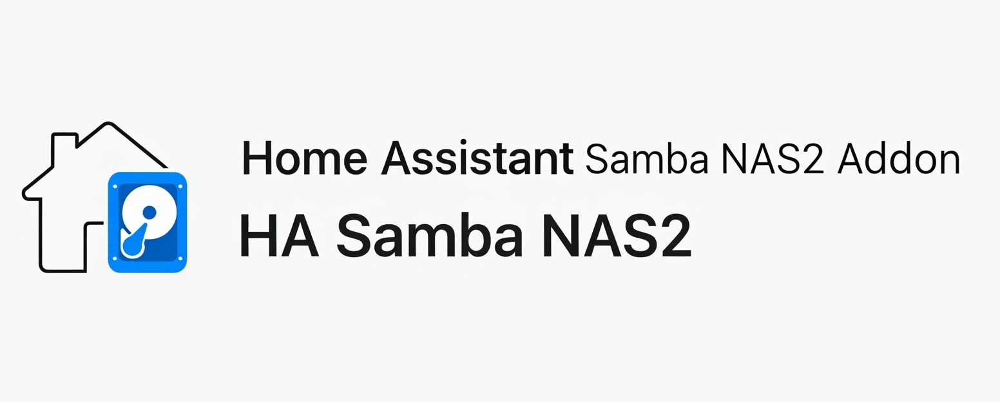

# Home Assistant Add-on: Samba NAS2 

## 🚨 Important Note 🚨

This addon has been designed, built and tested to work with HAOS (Homeassistant Operating System). The use in other types of installations is not recommended and useless as other solutions given by the host can be used.

## Installation

Follow these steps to get the add-on installed on your system:

1. Navigate in your Home Assistant frontend to **Supervisor** -> **Add-on Store**.
2. Find the "Samba NAS2" add-on and click it.
3. Click on the "INSTALL" button.
4. Turn on "Show in sidebar" option
5. Turn off "Protection mode" option
6. In the configuration section, set a username and password.
7. Click on the "START" button. 
8. Wait until the addon start
9. Click "Samba NAS 2" on your sidebar

## How to use

1. In the configuration section, set a username and password.
2. Review the enabled shares. Disable any you do not plan to use. Shares can be re-enabled later if needed.

## Connection

If you are on Windows you use `\\<IP_ADDRESS>\`, if you are on MacOS you use `smb://<IP_ADDRESS>` to connect to the shares.

This addon exposes the following directories over smb (samba):

| Directory       | Description                                                              |
| --------------- | ------------------------------------------------------------------------ |
| `addons`        | This is for your local add-ons.                                          |
| `backup`        | This is for your snapshots.                                              |
| `config`        | This is for your Home Assistant configuration.                           |
| `addon_configs` | This is for your Addons base configuration directory                     |
| `media`         | This is for local media files.                                           |
| `share`         | This is for your data that is shared between add-ons and Home Assistant. |
| `ssl`           | This is for your SSL certificates.                                       |

## Configuration

This is an example of a configuration. **_DO NOT USE_** without making the necessary changes especially for the username, password, secret and moredisk part.
Fields between `<` and `>` indicate values that are omitted and need to be changed.

```yaml
  wsdd: true
  wsdd2: false
  update_srat_onstart: no
  interfaces: []
```

### Option: `log_level` (optional)

The log_level option controls the level of log output by the addon and can be changed to be more or less verbose, which might be useful when you are dealing with an unknown issue. Possible values are:

- trace: Show every detail, like all called internal functions.
- debug: Shows detailed debug information.
- info: Normal (usually) interesting events.
- warning: Exceptional occurrences that are not errors.
- error: Runtime errors that do not require immediate action.
- fatal: Something went terribly wrong. Add-on becomes unusable.

Please note that each level automatically includes log messages from a more severe level, e.g., debug also shows info messages. By default, the log_level is set to info, which is the recommended setting unless you are troubleshooting.

### Option: `interfaces` (optional) (**advanced users only**)

The network interfaces Samba should listen on for incoming connections.

This option should only be used in advanced cases. In general, setting this option is not needed.

If omitted Samba will listen on all supported interfaces of Home Assistant (see > ha network info), but if there are no supported interfaces, Samba will exit with an error.

**Note**: Samba needs at least one non-loopback, non-ipv6, local interface to listen on and become browser on it. Without it, it works, but reloads it's interfaces in an infinite loop forever in each 10 seconds to check, whether a non-loopback, non-ipv6, local interface is added. This reload will fill the log file with infinite number of entries like added interface lo ip=::1 bcast= netmask=ffff:ffff:ffff:ffff:ffff:ffff:ffff:ffff.

### Option: `bind_all_interfaces` (optional)

Force Samba to bind on all network interface.
This is usefull for pseudo-ethernet devices like TailScale

Defaults to `false`.

### Option: `wsdd`

Setting this option to `true` will enable the use of wsdd over internal samba system.

Defaults to `true`.

### Option: `wsdd2` (optional) (**advanced users only**)

Setting this option to `true` will enable the use of wsdd2 over wsdd. Set to true if you have trouble to see the disk on Windows 11+

Defaults to `false`.

### Option: `hdd_idle_seconds` (optional) (**Use only if your disks never spind down**)

Idle time in seconds for all disks. Setting this value to 0 will never spin down the disk(s).

**NOTE<sup>1</sup>**: Depending on your environment host system can take up to **10minutes** to unlock used file on disk so setting to a low number like 10 don't garantee that the disk go on sleep after 10s from last access. Sometime you need to wait 10 or 15 minutes.
**NOTE<sup>2</sup>**: If you use `mqtt_nexgen_entities` also enable a new sensor for power disk status.

Defaults to hd-idle demon not being used at all.

### Option: `enable_smart` (optional)

Enable SMART on all disks, enable automatic offline testing every four hours, and enable autosaving of SMART Attributes.

Defaults to `true`.

### Options `update_srat_onstart` (optional) **_Exteprimental_**

SRAT (Samba REST Administration Tool) is a new system designed to provide a simplified user interface for configuring SAMBA. It has been developed to work within Home Assistant, specifically for this addon, but can also be used in other contexts.

Currently under development and in an alpha state, SRAT is set to become the preferred system for configuring and using this addon, eventually "retiring" the YAML configuration.

Setting this option to `release` or `prerelease` turn on the auto update of srat ( Samba Rest Adminitration Tool )
on the choosed channel.

Defaults to `no`

## Support

### Do you like the Addon?
<a href="https://www.buymeacoffee.com/ypKZ2I0"></a>

### Common problems

- **_In the menu `Media Browser` the folder with the name of the disk is empty_** : it happens when the homeassistant server starts before the add-on. Restart HomeAssitant from menu `Configuration->Server Controls->Server management -> RESTART`

In case you've found a bug, please [open an issue on our GitHub][issue].

[issue]: https://github.com/dianlight/hassio-addons/issues
[reddit]: https://reddit.com/r/homeassistant
[repository]: https://github.com/dianlight/hassio-addons
